# LuxuryAER

**LuxuryAER** is a microservice based application for booking flights.

## Involves 6 microservices, namely:
- Discovery Service
- Authentication Service
- Listing Service
- Ticket Reservation Service
- Payment Service
- Notify Service
- Front-end Service
- Rabbit-MQ Service

## Features
### Load Balancing: 
- To distribute incoming network traffic across multiple instances of a service to ensure no single instance is overwhelmed with too much traffic.
- Uses round robin fashion.
### Discovery Service: 
- The discovery service runs on port 5000 and allows all the services to register the port they are using. 
- This service helps us know where each instance is located. 
- It acts as a registry in which the addresses of all instances are tracked. 
- It serves  the front end/ UI.
### Authentication Service: 
- Has sign-up and login routes.
- Sign-up adds the username(email) and password to the users database.
- Login checks if the entered credentials match with that in database.
### Booking Service: 
- Has add-flight and get-bookings routes.
- Using add-flight, we can add data to flights database and using get-bookings we can list the flights based on the search filter. 
- The Booking front-end interacts with this mcroservice’s get-bookings to show the available flights.
### Ticket Reservation Service: 
- Has a make-reservation route.
- Checks if there are seats available in the flight requested by the user.
- Deducts the number of seats available from flights database and inserts a record into the booking database.
### Payment Service: 
- Has a make_payment route.
- Receives request from the reservation microservice with details of the booking, inserts a record into payment database if it was a success.
- Sends the payment completion/ confirmation message to the RabbitMQ’s payment_queue.
### RabbitMQ Service:
- Listens to payment_queue and displays messages as user notifications.
- Distributes notifications (e.g., payment status) using round-robin load balancing.
- Ensures reliable message delivery through the Notify Service.
### Front End Service:
- Facilitates direct user interaction with the system, enabling access to modules such as booking, reservation, and authentication.
- Designed with minimal dependency on other services to enhance user experience and system efficiency.

## Run Locally

Clone the project

```bash
  git clone https://github.com/Kenneth-Fernandes-0620/Flight-Booking-Application-using-Microservices.git
```
Start docker compose

```bash
  docker-compose up --build
```


## Screenshots
### Load Balancing & Discovery
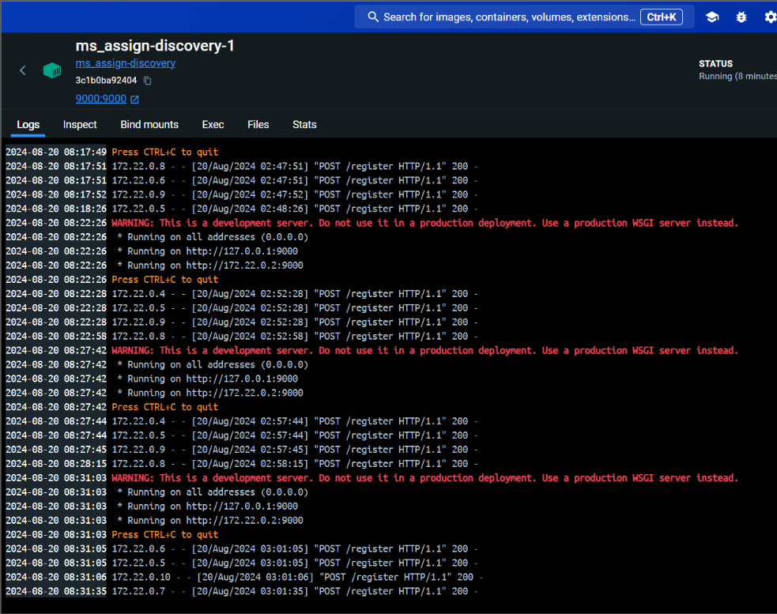 *Fig: Discovery service and round robin load balancing*
### Authentication 
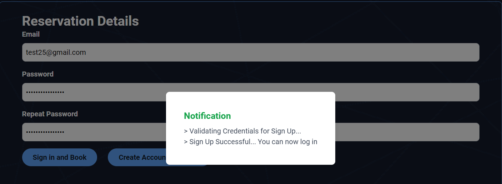 *Fig: Authenticates the credentials of the users. (Successful)*
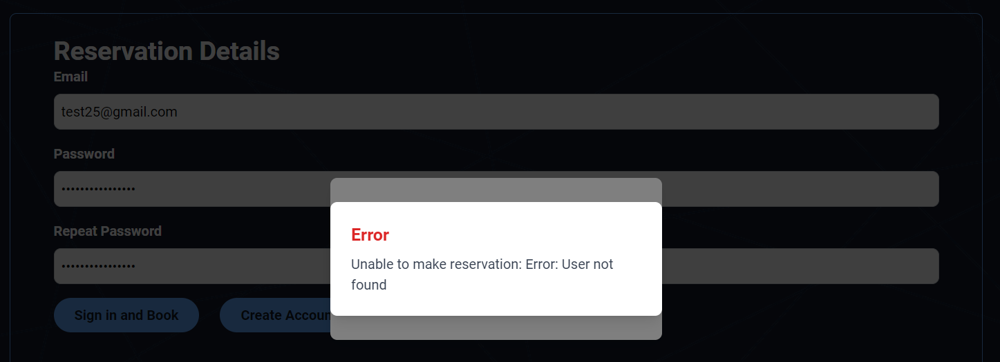 *Fig: Authenticates the credentials of the users. (Unsuccessful)*
### Listing 
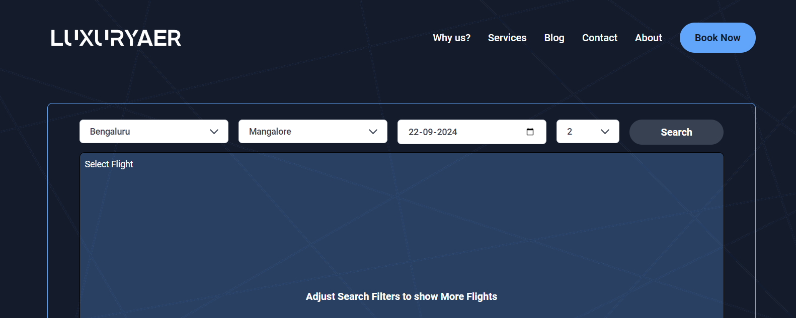 *Fig: Listing page*
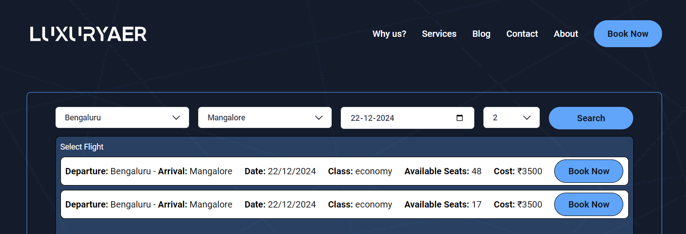 *Fig: List of flights available based on the filters*
### Ticket Reservation
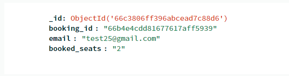*Fig: Booking database*
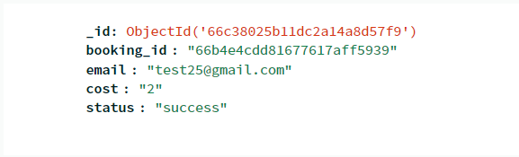 *Fig: Payments database*
### Payment & Notify
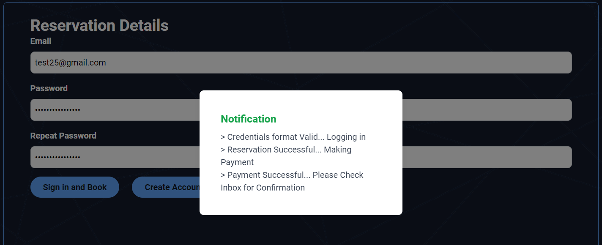 *Fig: Once the payment is successful, using RabbitMQ, message is pushed and pulled by notify service.*
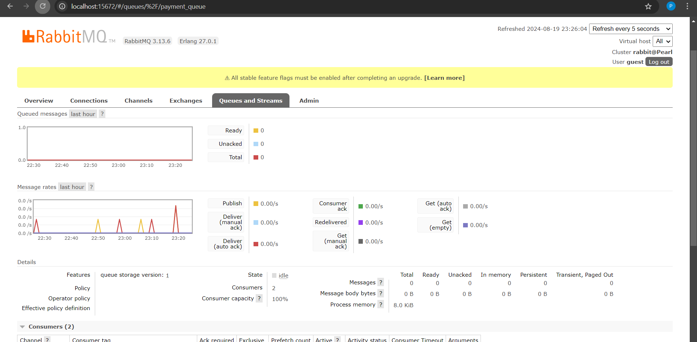 *Fig: RabbitMQ.*
### Deployment
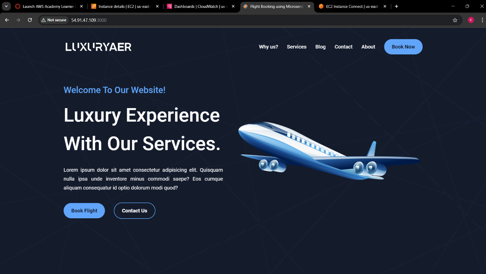 *Fig: Deployed on EC2 instance*
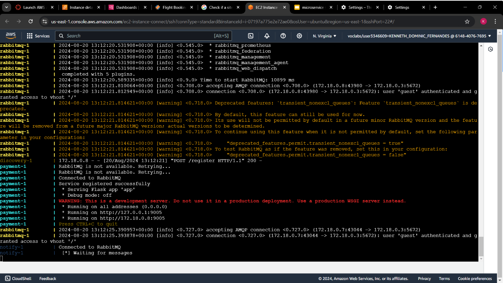 *Fig: Docker running on EC2 instance*

## Authors

- [@Kenneth-Fernandes-0620](https://github.com/Kenneth-Fernandes-0620)

- [@Pearl-Dsilva](https://github.com/Pearl-Dsilva)
